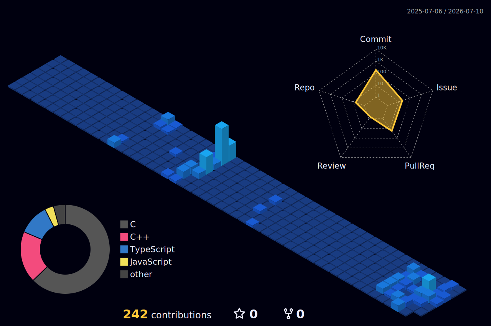

<!-- Animated typing header -->

  

  Developer with a C/C++ &amp; Java background, now building with <b>TypeScript&nbsp;+&nbsp;React</b> and learning <b>Go</b>.

 

<!-- Tech stack -->
<h3 align="center">🛠️ Tech I work with</h3>

  

<h3 align="center">🌱 Currently learning</h3>

  

 

<!-- Stats cards (navy + pastel-blue theme) -->

  
  

  

 

<!-- 3D contribution graph (generated daily by the GitHub Action in .github/workflows) -->
<h3 align="center">📊 My contribution graph in 3D</h3>

  

